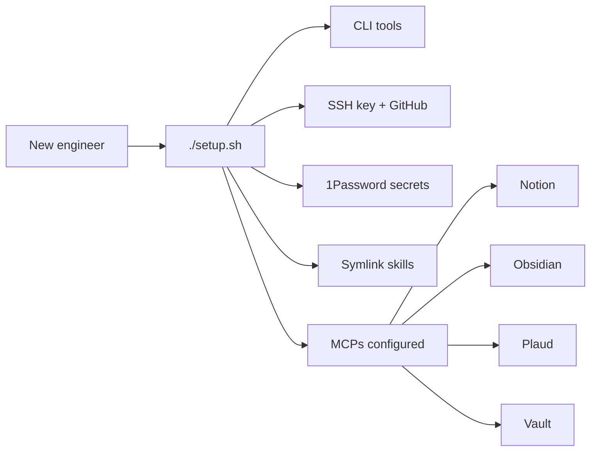
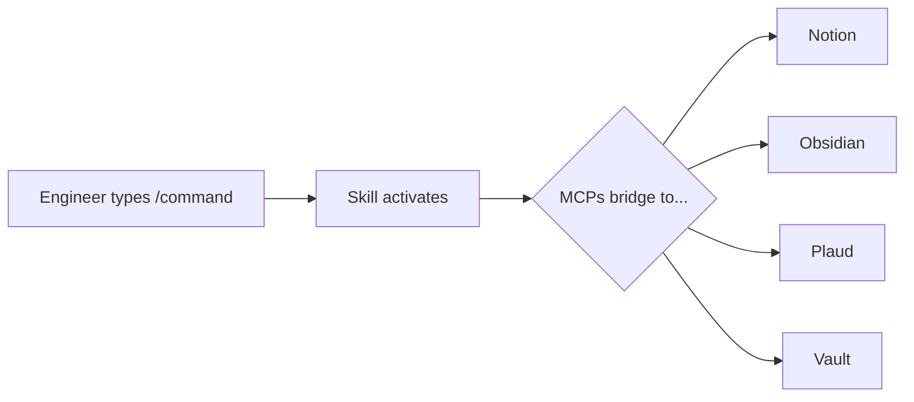
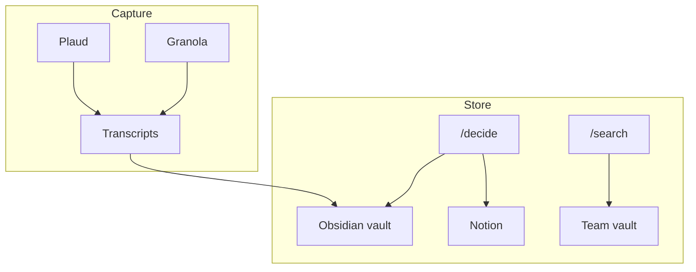

# Company OS

Any new employee can set up this repo and become a Claude Code power user on day one.

## Setup (5 minutes)

**Prerequisites:** Install [Homebrew](https://brew.sh) if you don't have it.

**Then run these 3 commands:**

```bash
brew install gh && gh auth login
gh repo clone your-org/company-os ~/company-os
~/company-os/setup.sh
```

That's it. `setup.sh` handles everything: CLI tools, SSH keys, 1Password secrets,
skills, MCPs, and daemon setup. It asks you a few questions along the way.

After setup finishes, start Claude Code:
```bash
cd ~/company-os && claude
```

To verify everything works, run `/setup --verify` in Claude Code.

### How setup works



### Re-running individual steps

Each step is a standalone script you can run independently:

```bash
bash ~/company-os/setup/steps/01-cli.sh      # CLI tools only
bash ~/company-os/setup/steps/06-mcps.sh      # MCPs only
bash ~/company-os/setup/steps/09-verify.sh    # Health checks only
~/company-os/setup.sh --verify                # Same as 09-verify.sh
```

---

## What You Get

Company OS is a shared repo that turns every engineer into a 10x Claude Code user. After setup, your machine has:

- **9 slash commands** — `/setup` for onboarding, `/build` to ship features, `/decide` for structured decisions, `/search` for deep research, `/eval` for testing and security, and more
- **4 MCP servers** — Notion integration, git-aware Obsidian vault, Plaud transcripts, team knowledge vault
- **Shared CLAUDE.md** — company context, coding standards, and safety rules that every Claude session reads
- **Automatic SSH key setup** — generates SSH keys and uploads them to GitHub

---

## Skills (Slash Commands)

Type these in any Claude Code session. Each runs a specialized workflow.

| Skill | Command | What It Does |
|---|---|---|
| **setup** | `/setup` | One-command onboarding — interactive setup through Claude Code's UI |
| **build** | `/build [feature]` | Complete dev workflow: brainstorm, plan, TDD, review, ship |
| **decide** | `/decide [question]` | Structured decision framework — 1-way vs 2-way doors, Council deliberation |
| **eval** | `/eval [component]` | Run evaluation suite on MCPs, agents, or skills. Also: `/eval secure` for security audits |
| **focus** | `/focus [brain dump]` | Paste messy thoughts, get a prioritized action plan |
| **momtest** | `/momtest [idea]` | Generate a bias-free Mom Test interview-question bank for customer discovery |
| **search** | `/search [topic]` | Deep research: vault + knowledge graph + web + Reddit/X |
| **sync** | `/sync [source]` | Sync Notion or Plaud data to the vault |
| **learn** | `/learn [topic]` | Claude Code best practices reference |

### Daily workflow



---

## MCPs (Model Context Providers)

| Server | What It Does |
|---|---|
| **notion** | Read/write Notion pages and databases. Full property type support. |
| **obsidian** | Read/write Obsidian vault files with git-aware sync. Auto-pulls before reads, auto-commits and pushes after writes. |
| **plaud** | Access Plaud meeting transcripts and summaries in real-time via Plaud Desktop. |
| **vault** | Search and read the team knowledge vault (shared across all engineers). |

### Data flow



---

## Repo Structure

```
company-os/
├── CLAUDE.md              # Company instructions every Claude session reads
├── README.md              # This file
├── setup.sh               # Thin wrapper → setup/init.sh
├── setup/                 # Modular setup scripts
│   ├── init.sh            # Entrypoint: sources libs, runs steps in order
│   ├── verify.sh          # Standalone shortcut for health checks
│   ├── lib/
│   │   ├── colors.sh      # Color codes + output helpers
│   │   └── utils.sh       # resolve_uv, safe_symlink, ensure_path
│   └── steps/
│       ├── 01-cli.sh      # CLI tools (brew, git, python, uv, node, bun, etc.)
│       ├── 02-ssh.sh      # SSH key + GitHub upload
│       ├── 03-apps.sh     # Desktop apps (Obsidian, Plaud)
│       ├── 04-1password.sh # Service account token + secret injection
│       ├── 05-skills.sh   # Symlink skills + clean stale hooks
│       ├── 06-mcps.sh     # Install MCPs (absolute uv path)
│       ├── 07-daemon.sh   # Plaud sync LaunchAgent
│       ├── 08-vault.sh    # Vault MCP team selection
│       ├── 09-verify.sh   # Health checks (standalone)
│       └── 10-summary.sh  # Final status table
├── .env.tpl               # 1Password secret template
├── skills/                # 9 slash commands
│   ├── setup/             # /setup — interactive onboarding
│   ├── build/             # /build — dev workflow
│   ├── decide/            # /decide — decision framework
│   ├── eval/              # /eval — evaluation + security audits
│   ├── focus/             # /focus — brain dump → action plan
│   ├── momtest/           # /momtest — Mom Test interview questions
│   ├── learn/             # /learn — Claude Code best practices
│   ├── search/            # /search — deep multi-source research
│   └── sync/              # /sync — external data sync
├── mcps/                  # 4 MCP servers
│   ├── notion-mcp/        # Notion page/database access
│   ├── obsidian-mcp/      # Git-aware Obsidian vault access
│   ├── plaud-mcp/         # Plaud transcript access
│   └── vault-mcp/         # Team knowledge vault + daemon
├── upgrades/              # Staging area (see below)
├── tests/                 # Integration tests
└── .claude/               # MCP + hooks config (auto-loaded)
    └── settings.json
```

---

## Quick Reference

| Action | How |
|---|---|
| Enter plan mode | Shift+Tab twice |
| Skip all permissions | `claude --dangerously-skip-permissions` |
| Resume last session | `/resume` |
| Cancel current action | Double-press Escape |
| Spawn parallel researchers | Say "spawn subagents" in your prompt |
| Get interactive questions | Say "use AskUserQuestion tool" |

---

## Engineering Standards

- **Keep it simple** — avoid over-engineering, no unnecessary abstractions
- **Python**: use ruff for formatting and linting
- **TypeScript**: use prettier for formatting
- **PRs**: short title (under 70 chars), summary + test plan in description
- **Safety**: never commit secrets, never force push to main, ask before destructive operations
